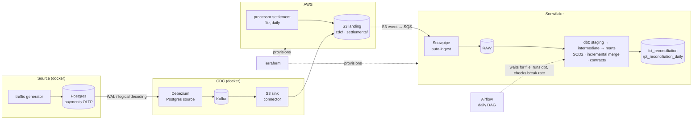

# Payments Ledger CDC & Reconciliation Warehouse

Every day a payments company has to prove that what its ledger says it charged matches what the card processor actually settled. Missing settlements, amount drift, and double settlements are real revenue leakage, and they are audit findings when nobody catches them.

This project streams every change from a payments database into Snowflake in near real time using **change data capture**. It keeps full history for every account, reconciles the ledger against a daily processor settlement file, classifies each break, and alerts when the break rate crosses a threshold.

## Architecture



| Layer | Tool | What it does |
|---|---|---|
| Source | Postgres 16 | `accounts` and `transactions`, with inserts, updates and hard deletes from a traffic generator |
| CDC | Debezium + Kafka | Reads the Postgres WAL and emits one event per row change, including deletes |
| Landing | Kafka Connect S3 sink | Writes NDJSON to S3, partitioned by hour and flushed every minute |
| Ingestion | Snowpipe | Auto-ingests CDC files and settlement CSVs via S3 event notifications |
| Transformation | dbt Core | Staging → current state + SCD2 → reconciliation marts, with tests, unit tests and contracts |
| Orchestration | Airflow 3 | Daily: wait for settlement file → source freshness → `dbt build` → break-rate check |
| Infrastructure | Terraform | S3, IAM (least-privilege writer and reader), Snowflake warehouse, database, RBAC, storage integration, service user |
| CI | GitHub Actions | ruff + pytest, `terraform fmt/validate`, `dbt parse` always, `dbt build` into a per-PR schema when secrets exist |

## What the reconciliation catches

`fct_reconciliation` has one row per transaction id seen on either side:

| break_type | Meaning | amount_at_risk |
|---|---|---|
| `MATCHED` | Settled once, same amount | 0 |
| `AWAITING_SETTLEMENT` | Captured recently; the file isn't due yet (T+1) | 0 |
| `MISSING_SETTLEMENT` | Ledger captured it, processor never settled | ledger amount |
| `AMOUNT_MISMATCH` | Settled for a different amount | abs(diff) |
| `DUPLICATE_SETTLEMENT` | Settled more than once | overpaid amount |
| `ORPHAN_SETTLEMENT` | Processor settled something the ledger has never seen | settled amount |
| `STATUS_MISMATCH` | Ledger says failed, processor settled it | settled amount |

The settlement generator injects each break type at a known rate and writes an answer key to `s3://…/ground_truth/`. This lets you measure detection precision and recall against it rather than assuming it works.

## Quickstart

Prerequisites: Docker, Terraform ≥ 1.6, Python 3.12, an AWS account, a Snowflake account (the 30-day trial works), and the [Snowflake CLI](https://docs.snowflake.com/en/developer-guide/snowflake-cli/index) (`snow`).

```bash
cp .env.example .env
pip install -r generator/requirements.txt dbt-core==1.12.5 dbt-snowflake==1.12.1

# 1. Keys. Register the admin public key on your own Snowflake user in Snowsight:
#    ALTER USER <you> SET RSA_PUBLIC_KEY='<admin key printed below>';
make keys

# 2. Infrastructure, pass 1. Put the svc public key in terraform.tfvars.
cp terraform/terraform.tfvars.example terraform/terraform.tfvars   # edit it
make tf-apply
#    Copy s3_bucket and the access key outputs into .env:
#    terraform -chdir=terraform output -raw pipeline_secret_access_key

# 3. Snowflake RAW layer (stages, tables, pipes)
make snowflake-setup
#    Copy notification_channel from the SHOW PIPES output into terraform.tfvars as snowpipe_sqs_arn

# 4. Infrastructure, pass 2: wires S3 → Snowpipe notifications
make tf-apply

# 5. Start the stream
make up && make connectors
make seed              # 7 days of history (Debezium's initial snapshot picks it up)
make settle-backfill   # processor files for those 7 days
make traffic           # optional: live inserts/updates/deletes, leave running in another tab

# 6. Transform + test
make dbt-build

# 7. Orchestrate
make airflow           # http://localhost:8080, then trigger payments_reconciliation_daily
```

Kafka UI runs at http://localhost:8081 so you can watch the topics and connector status.

**Tear down:** run `make down && make destroy`. The warehouse auto-suspends after 60s, so idle cost is close to zero, but destroy when you're done.

### Why two Terraform passes?

Snowpipe's auto-ingest queue is created by Snowflake when the first pipe exists, and the S3 bucket notification needs that queue's ARN. The alternatives are to create pipes in Terraform or to use SNS fan-out. Two passes is the simplest honest version, and it's documented rather than hidden.

## Design decisions (talking points for interviews)

- **Order by LSN, not by timestamp or arrival time.** Debezium adds the Postgres log sequence number to each event. It is the only ordering that is guaranteed to match commit order. `loaded_at` isn't (Snowpipe loads files in parallel) and `updated_at` isn't either (clock skew, same-millisecond updates).
- **Idempotent incremental merge with an LSN guard.** `fct_transactions` re-reads a one-hour lookback window and only merges an incoming row if its LSN is newer than what's already stored. Late or replayed files can never roll a transaction's state backwards.
- **At-least-once is assumed everywhere.** The S3 sink rotates files on a wall-clock schedule, which gives up the connector's exactly-once guarantee in exchange for one-minute freshness. Every downstream model deduplicates on `(key, LSN)`, so duplicates are harmless.
- **Hard deletes become soft deletes.** `REPLICA IDENTITY FULL` makes delete events carry the full row, and `is_deleted` preserves that information for audit. Batch extracts silently miss deletes entirely.
- **Two SCD2 implementations, on purpose.** `snap_accounts` is a classic dbt snapshot, which polls state on each run and loses changes that happen between runs. `dim_accounts` is built directly from CDC events and keeps every committed version. Being able to explain why both exist is the point.
- **Schema-on-read landing.** All CDC topics land in one `VARIANT` table, so a new upstream column never breaks ingestion. Typing happens in dbt staging, where it's tested.
- **Contract on the finance-facing model.** `fct_reconciliation` has an enforced dbt contract. A change that alters its column names or types fails the build instead of silently breaking reports.
- **Tested at three levels.** pytest covers the break-injection logic. A dbt unit test covers every classification branch using mocked inputs, with no warehouse data needed. Data tests (a conservation-of-value test, uniqueness, and one current version per account) run on real data.
- **Least privilege.** The pipeline IAM user can only write to its bucket, and Snowflake's role can only read it. The dbt/Airflow service user is key-pair only and owns nothing outside `PAYMENTS`.

## Repo layout

```
connect/        Kafka Connect image + Debezium and S3 sink configs
postgres/       source schema (replica identity, updated_at triggers)
generator/      traffic.py (OLTP load), settlements.py (processor file + answer key), tests
terraform/      AWS + Snowflake infrastructure
snowflake/      RAW stages, tables, Snowpipes
dbt/            staging → intermediate → marts, snapshot, unit + data tests
airflow/        Airflow 3 image + daily reconciliation DAG
.github/        CI
```

## Status and known gaps

**Verified so far**
- Local CDC path runs end to end: Postgres → Debezium → Kafka, including updates and hard deletes (`__op: u` / `__op: d`, `__deleted: true`).
- Connector versions pinned after the first successful run: Debezium Postgres 3.2.6, Confluent S3 sink 12.1.13.
- Debezium 3.x removed `delete.handling.mode`; the config now uses `delete.tombstone.handling.mode=rewrite`.
- Python tests pass, the Airflow DAG loads cleanly, and `dbt parse`/`compile` succeed.

**Not yet verified:** the cloud half (S3 → Snowpipe → Snowflake → dbt → Airflow). Likely first-run tweaks:
- **Snowflake Terraform provider:** pinned to `~> 1.0`; resource names and preview-feature flags differ between majors.
- **dbt contract types:** if Snowflake reports a type mismatch on `fct_reconciliation`, align the `data_type` in `_marts.yml`.

## Roadmap

- [ ] Score reconciliation against `ground_truth/` (precision and recall per break type) as a dbt model
- [ ] Refund settlement reconciliation (separate processor record type)
- [ ] Streamlit dashboard: daily break rate, aging of open breaks, amount at risk
- [ ] Slack alerting via Airflow notifier
- [ ] Slim CI (`state:modified+`, deferring to the prod manifest)
- [ ] Swap local Kafka for Amazon MSK Serverless via Terraform
